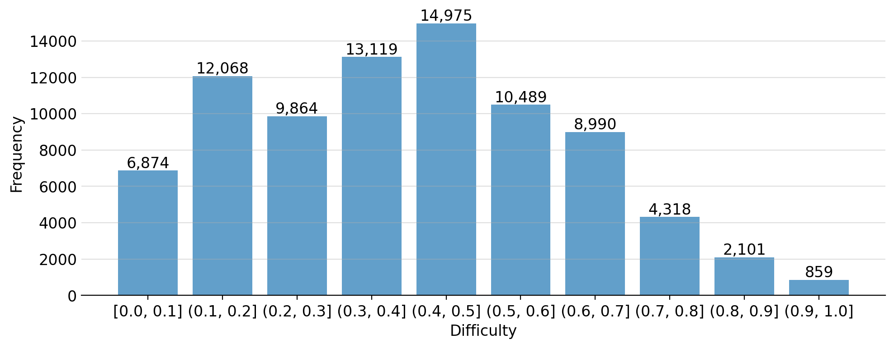

# PuzzleCloneData

[](LICENSE)
[](https://github.com/puzzleclone/PuzzleClone/stargazers)

**A comprehensive, diverse, and verifiable dataset of over 83k logical puzzles generated by [PuzzleClone](https://github.com/puzzleclone/PuzzleClone).**

## 🌟 Dataset Overview

PuzzleCloneData contains 83,657 unique logical reasoning puzzles procedurally generated from 86 seed puzzles. 
The dataset spans:
- Various applications of Satisfiability Modulo Theories (SMT) and SMT-like puzzles,
- Classic logical puzzles like Sudoku, the Knapsack problem, and linear optimization (LP).
- Diverse mathematical problems of varying difficulties.

Remarkable features:
- ✅ **Guaranteed Verifiability:** Every problem is generated with a ground-truth solution and is formally verifiable via symbolic SMT solving or deterministic program execution, ensuring correctness.
- 🎯 **Granular Control:** Offers fine-grained control over problem attributes like scale, structure, and difficulty through a set of adjustable parameters, enabling large-scale batch generation.
- ✨ **Flexible Adaptation:** Facilitates the easy customization of problem scenarios and translation into different languages or domains.

## 🏗️ Dataset Structure

```
PuzzleCloneData/
├── normal/                 # Normal difficulty problems
│   ├── RL_train.jsonl      # Reinforcement Learning training data
│   ├── RL_validate.jsonl   # Reinforcement Learning validation data
│   ├── SFT.jsonl           # Supervised Fine-Tuning data
│   └── Test.jsonl          # Test data
├── hard/                   # Hard difficulty problems
│   ├── RL_train.jsonl      # Reinforcement Learning training data
│   ├── RL_validate.jsonl   # Reinforcement Learning validation data
│   ├── SFT.jsonl           # Supervised Fine-Tuning data
│   └── Test.jsonl          # Test data
└── readme.md
```

## 📊 Key Statistics

### General Statistics

| Split | Normal Difficulty | Hard Difficulty | Total |
|-------|------------------|-----------------|-------|
| **RL Training** | 50,738 | 23,616 | 74,354 |
| **RL Validation** | 430 | 430 | 860 |
| **SFT Training** | 2,161 | 2,139 | 4,300 |
| **Test** | 5,730 | 2,713 | 8,443 |
| **Total** (*) | **56,898** | **26,759** | **83,657** |

\**SFT training samples are selected from other training splits and thus are not included in the overall total.*

### Difficulty Distribution

Puzzle complexity is quantified using a composite difficulty score (between 0 and 1, higher means more difficult), calculated as the normalized average of four features: the number of random variables, the number of logical constraints, the problem description length, and a custom variable domain difficulty metric (var scale).

The difficulty distribution of the puzzles is visualized below.



### Question Type Distribution 

| File (*)                  | 简答题 (Short Answer) | 单选题 (Multiple-Choice)  | 填空题 (Fill-in-the-Blank)  |
|---------------------------|----------------------|------------------------|----------------------------|
| *normal/RL_validate.jsonl*| 390                  | 95                     | 10                         |
| *normal/Test.jsonl*       | 5,108                | 1,262                  | 124                        |
| *normal/SFT.jsonl*        | 1,966                | 475                    | 50                         |
| *normal/RL_train.jsonl*   | 45,195               | 11,202                 | 1,099                      |
| *hard/RL_validate.jsonl*  | 390                  | 95                     | 10                         |
| *hard/Test.jsonl*         | 2,514                | 644                    | 78                         |
| *hard/SFT.jsonl*          | 1,934                | 475                    | 50                         |
| *hard/RL_train.jsonl*     | 21,889               | 5,631                  | 679                        |
| **Total** (**)            | **75,486**           | **18,929**             | **2,000**                  |

\**If a puzzle has multiple sub-questions, the question types of these sub-questions will be separately counted.*

\*\**SFT training samples are selected from other training splits and thus are not included in the overall total.*

### Answer Type Distribution 

PuzzleClone supports 8 different types of puzzle answers:

- **numeral**: Numeric answers (e.g., a number or a list of numbers).
- **option**: Single-letter answers (e.g., 'A', 'B') representing the selected option.
- **ordered array**: Answers that are arrays where the order of elements matters.
- **nominal**: Answers that are categorical labels or names.
- **unordered array**: Arrays where the order of elements does not matter.
- **ooa_numeral**: Two-dimensional arrays of numeric values where the orders of elements in both dimensions matter.
- **ooa_nominal**: Two-dimensional arrays of nominal values where the orders of elements in both dimensions matter.
- **oua_nominal**: Two-dimensional arrays of nominal values where only the order of elements in the outer dimension matters.

The following table shows the distribution of the answer types in PuzzleClone.

| File (*)                  | numeral | option | ordered array | nominal | unordered array | ooa_numeral | ooa_nominal | oua_nominal |
|---------------------------|---------|--------|---------------|---------|----------------|-------------|-------------|-------------|
| *normal/RL_validate.jsonl*| 180     | 95     | 80            | 70      | 55             | 5           | 5           | 5           |
| *normal/Test.jsonl*       | 2,089   | 1,262  | 1,232         | 961     | 727            | 55          | 77          | 91          |
| *normal/SFT.jsonl*        | 910     | 475    | 404           | 352     | 275            | 25          | 25          | 25          |
| *normal/RL_train.jsonl*   | 18,444  | 11,202 | 10,936        | 8,503   | 6,442          | 483         | 681         | 805         |
| *hard/RL_validate.jsonl*  | 180     | 95     | 80            | 70      | 55             | 5           | 5           | 5           |
| *hard/Test.jsonl*         | 1,501   | 644    | 351           | 433     | 227            | 46          | 24          | 10          |
| *hard/SFT.jsonl*          | 890     | 475    | 396           | 348     | 275            | 25          | 25          | 25          |
| *hard/RL_train.jsonl*     | 13,175  | 5,631  | 3,011         | 3,756   | 1,928          | 406         | 208         | 84          |
| **Total** (**)            | **35,569** | **18,929** | **15,690** | **13,793** | **9,434** | **1,000** | **1,000** | **1,000** |

\**If a puzzle has multiple sub-questions, the question types of these sub-questions will be separately counted.*

\*\**SFT training samples are selected from other training splits and thus are not included in the overall total.*

## 🔧 Data Schema

Each JSONL entry contains the following fields:

```
{
  "problem": "string",      // Problem statement in Chinese
  "answer": "string",       // Answer. If multiple queries exist, answers will be separated by '===='
  "parameters": {           // Problem parameters
    "cond_num": "int",      // Number of conditions
    "sym_num": "int",       // Number of symbols
    "sym_type": "array",    // Types of symbols used
    "vars_scale": "float"   // Variable scaling factor (0-1 scale)
  },
  "config": {...},          // Problem configuration
  "qtype": "string",        // Question types ("简答题" | "单选题" | "填空题"). If multiple queries exist, their types will be separated by ','
  "eval_type": "string",    // Evaluation types ("numeral" | "nominal" | "ordered_array" | "unordered_array" | "ooa" | "oua"). If multiple queries exist, their types will be separated by ','
  "source": "string",       // Source seed puzzle identifier (e.g., "A1-ant")
  "id": "string",           // Unique problem identifier
  "difficulty": "float"     // Difficulty score (0-1 scale)
}
```

## 🧠 Baseline Model Performance

The following table summarizes the performance of several baseline models evaluated on the PuzzleClone test set.
Accuracy is reported for each model on the \textit{Normal} and \textit{Hard} subsets, along with their average.

| Model                          | Normal | Hard | Avg. |
|--------------------------------|--------|------|------|
| **Proprietary Models**         |        |      |      |
| ChatGPT-4o                     | 31.6   | 24.6 | 28.2 |
| ChatGPT-o3                     | 87.1   | 83.4 | 85.3 |
| ChatGPT-5                      | **91.1**   | **86.3** | **88.7** |
| Gemini-2.0-flash               | 42.0   | 31.6 | 36.8 |
| Gemini-2.5-pro                 | 75.8   | 67.2 | 71.5 |
| Gemini-3-pro                   | 86.5   | 83.0 | 84.8 |
| Claude-3.5-sonnet              | 37.6   | 27.4 | 32.5 |
| Claude-4-sonnet                | 62.7   | 46.8 | 55.3 |
| Seed1.6                        | 87.8   | 82.4 | 85.1 |
| **GLM Series**                 |        |      |      |
| GLM-Z1-9B-0414                 | 63.6   | 53.5 | 58.6 |
| GLM-Z1-32B-0414                | 71.1   | 60.9 | 66.0 |
| **Qwen2.5 Series**             |        |      |      |
| Qwen2.5-7B-Instruct            | 16.8   | 12.1 | 14.5 |
| Qwen2.5-14B-Instruct           | 24.3   | 17.9 | 21.1 |
| Qwen2.5-32B-Instruct           | 31.4   | 23.5 | 27.4 |
| Qwen2.5-72B-Instruct           | 32.8   | 25.3 | 29.0 |
| **Qwen3 Series**               |        |      |      |
| Qwen3-8B                       | 71.6   | 59.4 | 65.5 |
| Qwen3-14B                      | 78.6   | 67.0 | 72.8 |
| Qwen3-32B                      | 77.0   | 68.1 | 72.5 |
| Qwen3-235B-A22B                | 82.9   | 73.8 | 78.3 |
| **DeepSeek Series**            |        |      |      |
| DeepSeek-R1-Distill-Qwen-14B   | 47.9   | 38.4 | 43.1 |
| DeepSeek-R1-Distill-Qwen-32B   | 53.3   | 43.2 | 48.3 |
| DeepSeek-R1-0528-Qwen3-8B      | 76.0   | 66.8 | 71.4 |
| DeepSeek-R1-0528               | 88.7   | 82.6 | 85.6 |


## 📄 License

Please refer to the repository license for usage terms and conditions.

## 🤝 Citation

If you use this dataset in your research, please cite:

```bibtex
@dataset{puzzleclonedata,
  title={PuzzleCloneData},
  author={PuzzleClone Team},
  year={2025},
  url={https://github.com/puzzleclone/PuzzleCloneData}
}
```

## 📞 Contact

For questions, issues, or contributions, please open an issue on the GitHub repository.
