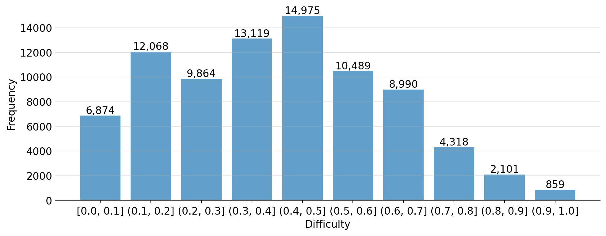

# PuzzleCloneData

[](LICENSE)
[](https://github.com/puzzleclone/PuzzleClone/stargazers)

**A comprehensive, diverse, and verifiable dataset of over 83k logical puzzles generated by [PuzzleClone](https://github.com/puzzleclone/PuzzleClone).**

## 📊 Dataset Overview

PuzzleCloneData contains 83,657 unique logical reasoning puzzles procedurally generated from 86 seed puzzles. 
The dataset spans:
- Various applications of Satisfiability Modulo Theories (SMT) and SMT-like puzzles,
- Classic logical puzzles like Sudoku, the Knapsack problem, and linear optimization (LP).
- Diverse mathematical problems of varying difficulties.

Remarkable features:
- ✅ **Guaranteed Verifiability:** Every problem is generated with a ground-truth solution and is verifiable by a symbolic SMT solver, ensuring correctness.
- 🎯 **Granular Control:** Offers fine-grained control over problem attributes like scale, structure, and difficulty through a set of adjustable parameters, enabling large-scale batch generation.
- ✨ **Flexible Adaptation:** Facilitates the easy customization of problem scenarios and translation into different languages or domains.

### Key Statistics

| Split | Normal Difficulty | Hard Difficulty | Total |
|-------|------------------|-----------------|-------|
| **RL Training** | 50,738 | 23,616 | 74,354 |
| **RL Validation** | 430 | 430 | 860 |
| **SFT Training** | 2,161 | 2,139 | 4,300 |
| **Test** | 5,730 | 2,713 | 8,443 |
| **Total** (*) | **56,898** | **26,759** | **83,657** |

\**SFT training samples are selected from other training splits and thus are not included in the overall total.*

### Difficulty Distribution

Puzzle complexity is quantified using a composite difficulty score (between 0 and 1, higher means more difficult), calculated as the normalized average of four features: the number of random variables, the number of logical constraints, the problem description length, and a custom variable domain difficulty metric (var scale).

The difficulty distribution of the puzzles is visualized below.



### Question Type Distribution 

| File (*)                  | 简答题 (Short Answer) | 单选题 (Single Choice)  | 填空题 (Fill-in-the-Blank)  |
|---------------------------|----------------------|------------------------|----------------------------|
| *normal/RL_validate.jsonl*| 390                  | 95                     | 10                         |
| *normal/Test.jsonl*       | 5,108                | 1,262                  | 124                        |
| *normal/SFT.jsonl*        | 1,966                | 475                    | 50                         |
| *normal/RL_train.jsonl*   | 45,195               | 11,202                 | 1,099                      |
| *hard/RL_validate.jsonl*  | 390                  | 95                     | 10                         |
| *hard/Test.jsonl*         | 2,514                | 644                    | 78                         |
| *hard/SFT.jsonl*          | 1,934                | 475                    | 50                         |
| *hard/RL_train.jsonl*     | 21,889               | 5,631                  | 679                        |
| **Total** (**)            | **75,486**           | **18,929**             | **2,000**                  |

\**If a puzzle has multiple sub-questions, the question types of these sub-questions will be separately counted.*

\*\**SFT training samples are selected from other training splits and thus are not included in the overall total.*

### Answer Type Distribution 

PuzzleClone supports 8 different types of puzzle answers:

- **numeral**: Numeric answers (e.g., a number or a list of numbers).
- **option**: Single-letter answers (e.g., 'A', 'B') representing the selected option.
- **ordered array**: Answers that are arrays where the order of elements matters.
- **nominal**: Answers that are categorical labels or names.
- **unordered array**: Arrays where the order of elements does not matter.
- **ooa_numeral**: Two-dimensional arrays of numeric values where the orders of elements in both dimensions matter.
- **ooa_nominal**: Two-dimensional arrays of nominal values where the orders of elements in both dimensions matter.
- **oua_nominal**: Two-dimensional arrays of nominal values where only the order of elements in the outer dimension matters.

The following table shows the distribution of the answer types in PuzzleClone.

| File (*)                  | numeral | option | ordered array | nominal | unordered array | ooa_numeral | ooa_nominal | oua_nominal |
|---------------------------|---------|--------|---------------|---------|----------------|-------------|-------------|-------------|
| *normal/RL_validate.jsonl*| 180     | 95     | 80            | 70      | 55             | 5           | 5           | 5           |
| *normal/Test.jsonl*       | 2,089   | 1,262  | 1,232         | 961     | 727            | 55          | 77          | 91          |
| *normal/SFT.jsonl*        | 910     | 475    | 404           | 352     | 275            | 25          | 25          | 25          |
| *normal/RL_train.jsonl*   | 18,444  | 11,202 | 10,936        | 8,503   | 6,442          | 483         | 681         | 805         |
| *hard/RL_validate.jsonl*  | 180     | 95     | 80            | 70      | 55             | 5           | 5           | 5           |
| *hard/Test.jsonl*         | 1,501   | 644    | 351           | 433     | 227            | 46          | 24          | 10          |
| *hard/SFT.jsonl*          | 890     | 475    | 396           | 348     | 275            | 25          | 25          | 25          |
| *hard/RL_train.jsonl*     | 13,175  | 5,631  | 3,011         | 3,756   | 1,928          | 406         | 208         | 84          |
| **Total** (**)            | **35,569** | **18,929** | **15,690** | **13,793** | **9,434** | **1,000** | **1,000** | **1,000** |

\**If a puzzle has multiple sub-questions, the question types of these sub-questions will be separately counted.*

\*\**SFT training samples are selected from other training splits and thus are not included in the overall total.*

## 🏗️ Dataset Structure

```
PuzzleCloneData/
├── normal/           # Normal difficulty problems
│   ├── RL_train.jsonl      # Reinforcement Learning training data
│   ├── RL_validate.jsonl   # Reinforcement Learning validation data
│   ├── SFT.jsonl          # Supervised Fine-Tuning data
│   └── Test.jsonl         # Test data
├── hard/             # Hard difficulty problems
│   ├── RL_train.jsonl      # Reinforcement Learning training data
│   ├── RL_validate.jsonl   # Reinforcement Learning validation data
│   ├── SFT.jsonl          # Supervised Fine-Tuning data
│   └── Test.jsonl         # Test data
└── readme.md
```

## 🔧 Data Schema

Each JSONL entry contains the following fields:

```
{
  "problem": "string",      // Problem statement in Chinese
  "answer": "string",       // Answer. If multiple queries exist, answers will be separated by '===='
  "parameters": {           // Problem parameters
    "cond_num": "int",      // Number of conditions
    "sym_num": "int",       // Number of symbols
    "sym_type": "array",    // Types of symbols used
    "vars_scale": "float"   // Variable scaling factor (0-1 scale)
  },
  "config": {...},          // Problem configuration
  "qtype": "string",        // Question types ("简答题" | "选择题" | "填空题"). If multiple queries exist, their types will be separated by ','
  "eval_type": "string",    // Evaluation types ("numeral" | "nominal" | "ordered_array" | "unordered_array" | "ooa" | "oua"). If multiple queries exist, their types will be separated by ','
  "source": "string",       // Source seed puzzle identifier (e.g., "A1-ant")
  "id": "string",           // Unique problem identifier
  "difficulty": "float"     // Difficulty score (0-1 scale)
}
```

## 🧠 Baseline Model Performance

The following table summarizes the performance of several baseline models evaluated on the PuzzleCloneData test set. Metrics such as accuracy and F1 score are reported for each model. 

| Model                          | Normal | Hard | Average |
|--------------------------------|--------|------|---------|
| **Proprietary Models**         |        |      |         |
| ChatGPT-o3                     | xx     | xx   | xx      |
| ChatGPT-4o                     | 31.5   | 23.8 | 27.7    |
| Gemini-2.0-flash               | xx     | xx   | xx      |
| Gemini-2.5-pro                 | xx     | xx   | xx      |
| Claude-3.5-sonnet              | xx     | xx   | xx      |
| Claude-4-sonnet                | xx     | xx   | xx      |
| **GLM Series**                 |        |      |         |
| GLM-Z1-9B-0414                 | 63.0   | 51.9 | 57.5    |
| GLM-Z1-32B-0414                | 70.5   | 59.0 | 64.8    |
| **Qwen2.5 Series**             |        |      |         |
| Qwen2.5-7B-Instruct            | 16.8   | 11.9 | 14.4    |
| Qwen2.5-14B-Instruct           | 24.3   | 17.4 | 20.9    |
| Qwen2.5-32B-Instruct           | 31.1   | 22.9 | 27.0    |
| Qwen2.5-72B-Instruct           | 32.6   | 24.6 | 28.6    |
| **Qwen3 Series**               |        |      |         |
| Qwen3-8B                       | 71.0   | 57.7 | 64.4    |
| Qwen3-14B                      | 78.1   | 65.0 | 71.6    |
| Qwen3-32B                      | 76.7   | 66.3 | 71.5    |
| Qwen3-235B-A22B                | 82.0   | 71.2 | 76.6    |
| **DeepSeek Series**            |        |      |         |
| DeepSeek-R1-Distill-Qwen-14B   | 47.5   | 37.2 | 42.4    |
| DeepSeek-R1-Distill-Qwen-32B   | 52.9   | 41.9 | 47.4    |
| DeepSeek-R1-0528-Qwen3-8B      | 75.4   | 64.7 | 70.1    |
| DeepSeek-R1-0528               | 87.7   | 80.2 | 84.0    |


## 📄 License

Please refer to the repository license for usage terms and conditions.

## 🤝 Citation

If you use this dataset in your research, please cite:

```bibtex
@dataset{puzzleclonedata,
  title={PuzzleCloneData},
  author={PuzzleClone Team},
  year={2025},
  url={https://github.com/puzzleclone/PuzzleCloneData}
}
```

## 📞 Contact

For questions, issues, or contributions, please open an issue on the GitHub repository.